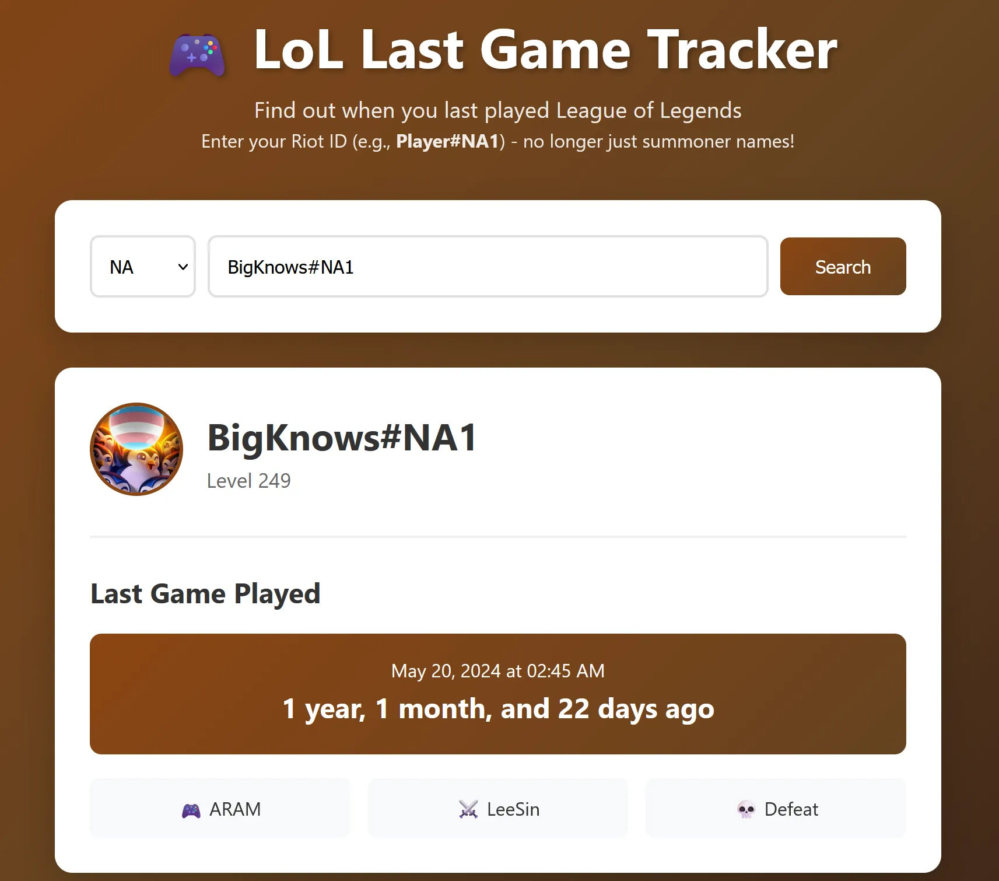
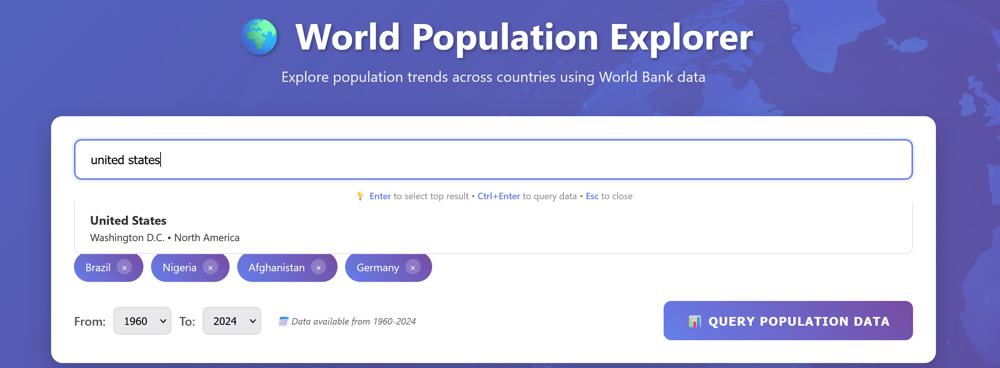
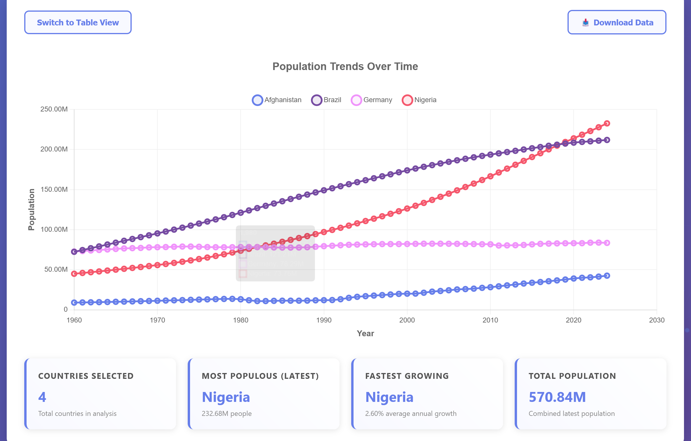
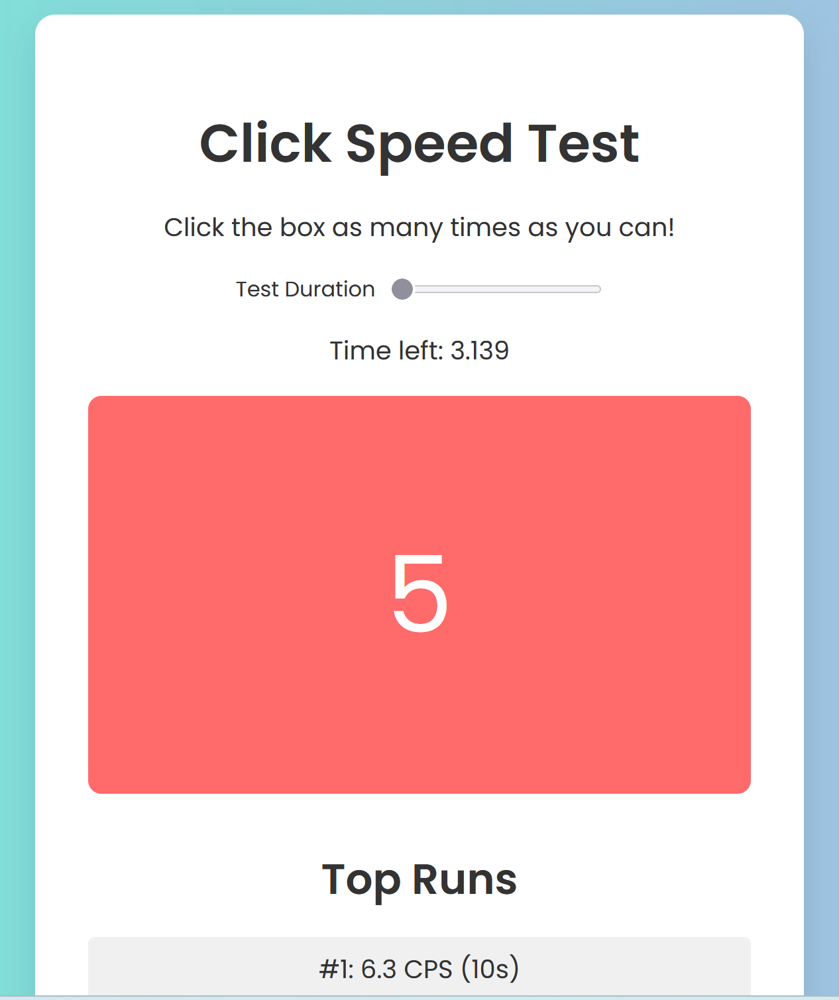
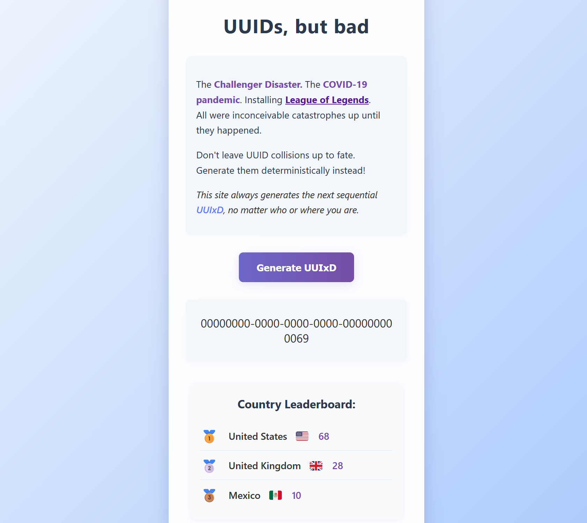
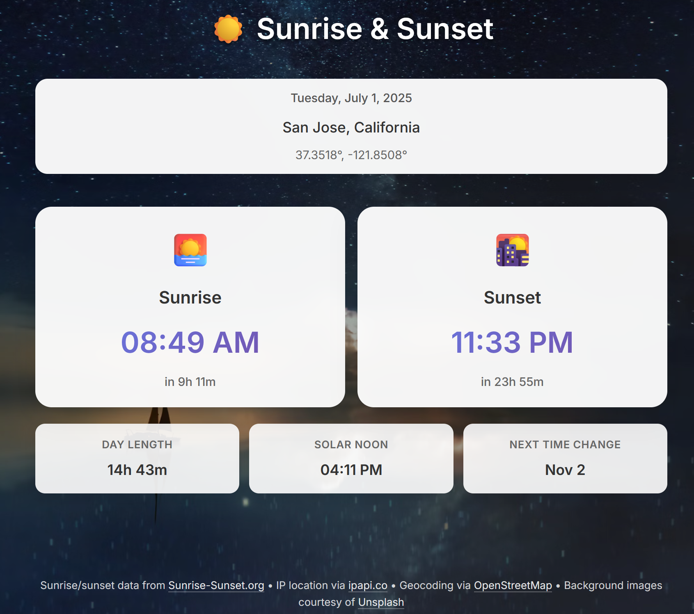

# Overview

I'm doing a challenge where I make a new website each day during July 2025 as a way to test out code assistant capabilities, learn new tools, and have fun!

??? "Site Requirements"
    - must be standalone (i.e. have a unique domain)
    - must be interactive
    - must be live -- pages aren't useful unless hosted somewhere!

??? "What's allowed"
    - backend not required
    - can be mostly or entirely vibe-coded
    - can self-host or use a free hosting solution (e.g. Github pages)

Each day I'll update this page with a brief blurb, a link to the site, and the amount of time I spent making it (includes code generation, debugging, and deployment). All frontend source code will be hosted on [Github](https://github.com/matthew-chandler/31days).

## Day 6: [League Last Game Tracker](https://league.machandler.com)

**Type:** Frontend and backend

**Time Spent:** ~2 hours

**Main LLM:** Claude Sonnet 4

Fun page that looks up what the last [League of Legends](https://www.leagueoflegends.com) game someone has played and determines how long they've been League-sober. The backend uses Flask and the frontend is just vanilla HTML/CSS/JS. It relies on the Riot Games API, for which I had to apply for an API key, to get player and match data.

Believe it or not, this was my first time using the same hostname (league.machandler.com) for both the frontend and backend. When I first started out doing web development and I was trying to figure things out myself, I had always built the frontend and backend completely separately and ended up always using different hostnames; before this, all of my backends routed via api.machandler.com through a single nginx configuration file. Of course I know now that using the same hostname is common practice, and I'll probably keep doing it in the future.

## Day 5: [World Population Explorer](https://population.machandler.com)

**Type:** Frontend only

**Time Spent:** ~30 minutes

**Main LLM:** Claude Sonnet 4

Site that lets the user explore the population trends of different countries over the past six decades. I'm definitely starting to get into the hang of things now.

## Day 4: [Fireworks](https://fireworks.machandler.com)

**Type:** Frontend only

**Time Spent:** ~1 hour

**Main LLM:** Claude Sonnet 4

Very basic site, although my first time using React in a while. Fireworks occasionally pop up before a city skyline background, and clicking the screen makes more fireworks appear. Happy 4th of July! 

## Day 3: [Click Test](https://cps.machandler.com)

**Type:** Frontend only

**Time Spent:** ~1 hour

**Main LLM:** Gemini 2.5 Pro

Super simple site that calculates the user's clicks per second and keeps a record of their best runs. This was my first time using Gemini, and while it seemed better than GPT-4.1, I think loses the battle to Claude. Gemini seemed to frequently tell me one thing and do something else.

## Day 2: [UUIxD](https://uuixd.machandler.com)

**Type:** Frontend & backend

**Time Spent:** ~4 hours

**Main LLM:** GPT-4.1

Joke website that generates a [UUID](https://en.wikipedia.org/wiki/Universally_unique_identifier), but it's the next one in the global sequence rather than random. It also comes with a leaderboard that tracks the top countries that have sent generation requests. Most of my woes (>2 hours) came from trying to debug network issues -- it turns out both [nginx](https://nginx.org/) and [Cloudflare](https://www.cloudflare.com) cached my site, and it took me a while to figure that out. 

This was my first time using [Flask](https://pypi.org/project/Flask/), but honestly GPT was able to take care of that pretty easily. I also learned that GPT-4.1 is a bit worse than Claude Sonnet 4 as far as agentic coding goes; I'll try [Gemini](https://blog.google/products/gemini/) tomorrow and see which one I like most.

## Day 1: [Sunrise and Sunset Timers](https://sun.machandler.com)

**Type:** Frontend only

**Time Spent:** ~3 hours

**Main LLM:** Claude Sonnet 4

First day looking pretty good! Simple website almost entirely written by [Claude Sonnet 4](https://www.anthropic.com/claude/sonnet) that grabs the user's location via IP address and displays sunrise and sunset times as well as some other interesting info. Some cool extra features are that the background changes depending on the time of day and you can also manually change the location. I probably shouldn't have spent so much time on this, but I kept playing around with Claude trying to add more and more features until I realized that I should probably be scaling back instead.

