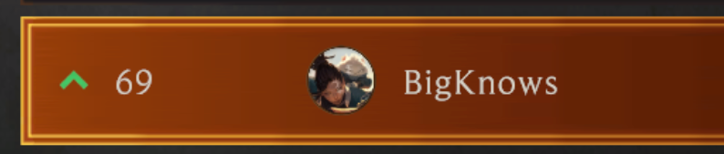
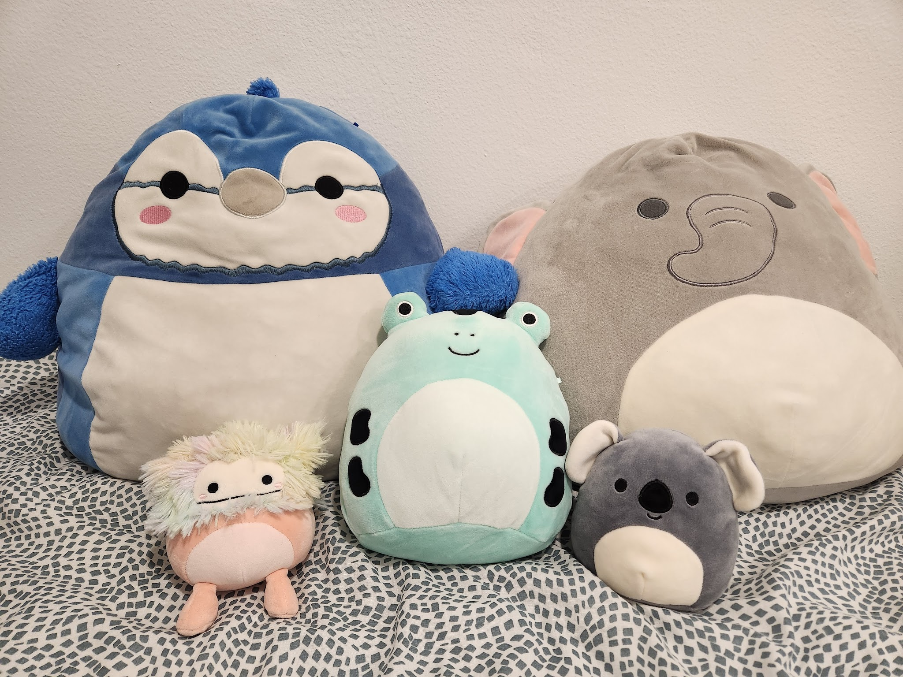

# Hi, I'm Matthew! 👋

I'm a currently a computer engineering student at UCLA. Though I mainly consider myself a software engineer, I've ending up mostly working on hardware projects and [internships](https://www.linkedin.com/in/chandler-matthew/) in the past. In my free time, I like to read, meditate, and go on walks. When they're in season, I also like to watch the NFL and [League tournaments](https://en.wikipedia.org/wiki/League_of_Legends_in_esports).

 

    

 

## Some fun facts

- I used to be pretty competitive in [Legends of Runeterra](https://playruneterra.com/en-us/), peaking at rank #69 on the Americas ladder back in 2022 before [Riot slashed support](https://playruneterra.com/en-us/news/game-updates/state-of-the-game-2024/) for the game's development. 
    

        
    

    Probably my favorite achievement is beating a [top ladder streamer](https://www.twitch.tv/xaikado) with a meme deck while it was on the first frontpage stream on [Twitch](https://twitch.tv).

- I hold an Associate of Arts in Business. Not everyday relevant but I guess it's cool :shrug:
- I like [Squishmallows](https://en.wikipedia.org/wiki/Squishmallows), and I've slowly collected them. Here's my family :smile: 
    

        
    

- I can recite what each of the [twenty-seven Constituional Amendments](https://constitutioncenter.org/the-constitution/amendments) does from memory.

## Connect with me

Feel free to add me on any of the social links listed in the footer! Recently, I've been trying to rate every book/movie/game I consume, and I'm happy to chat about anything.

